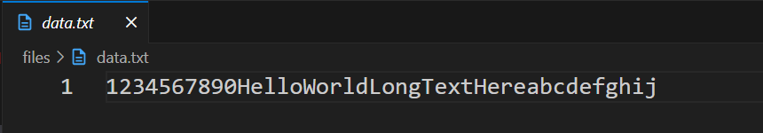
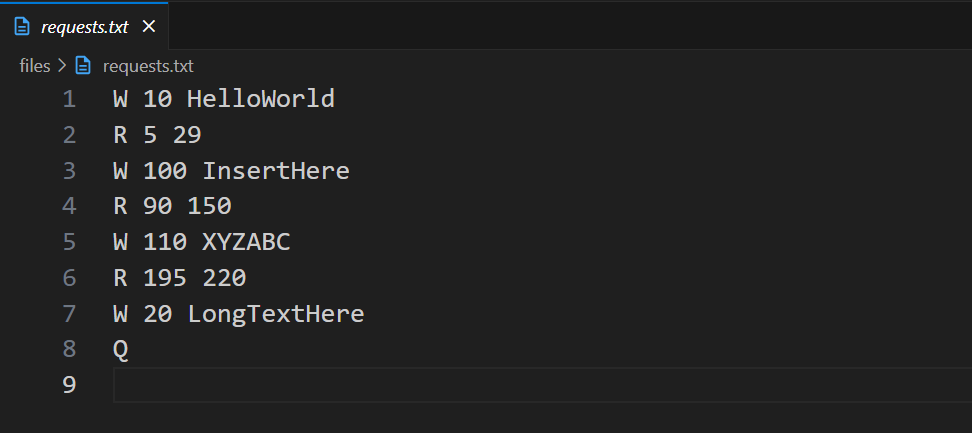
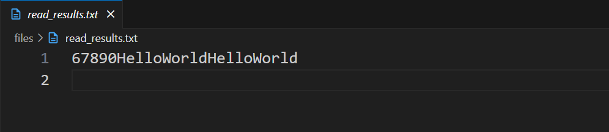

# File Processing System 🗂️  

🛠️ C program that processes file commands like a mini file-engine

## Table of Contents  

1. [About](#about)  
2. [Features](#features)  
3. [Requirements](#requirements)  
4. [Installation](#installation)  
5. [Usage](#usage)  

---

## About

The **File Processing System** is a C program that processes read and write commands from a requests file and updates a data file accordingly.  
It demonstrates low-level file operations (`open`, `read`, `write`, `lseek`) and ensures correct handling of offsets and data integrity.

---

## Features

- Reads specific byte ranges from `data.txt` and saves the results to `read_results.txt`  
- Writes new data at given offsets without overwriting existing content  
- Processes commands from a requests file (`requests.txt`)  
- Handles invalid offsets and ensures data integrity  
- Persists all changes to the original data file

---

## Requirements

- Linux, macOS, or Windows with WSL  
- GCC (GNU Compiler Collection) or another C compiler  
- Make (to build the project)  
- Git (to clone the repository)  

---

## Installation

Follow these steps to set up the project locally:

---

### 1. Clone the repository
```bash
git clone https://github.com/Amit-Bruhim/File-Processing-System.git
```

### 2. Compile and Run the program using Make
```bash
make run
```

---

## Usage

The program expects the input files to be inside the `files/` directory:

- `data.txt` – the main data file that will be read from and written to  
- `requests.txt` – contains the series of commands for the program to process  

### Command Format

The program supports three types of commands in the requests file:

- **`R <start_offset> <end_offset>`** – Reads bytes from `data.txt` starting at `start_offset` and ending at `end_offset` (inclusive).  

- **`W <offset> <text>`** – Writes `<text>` at the given `offset` in `data.txt`. Existing data is shifted forward to preserve content.  

- **`Q`** – Quit the program immediately. Any remaining commands will not be processed.  

### Example Input Files

Instead of showing each command separately, here is an example of **full input files**:

**data.txt**  



**requests.txt**
  


### Output

All read results are written to `files/read_results.txt`. After the program finishes, you can check this file for the results of all `R` commands.  



> **Note:** For convenience, the `data.txt` and `requests.txt` files already contain example content so you can run the program immediately. You are free to modify them to test different scenarios.

